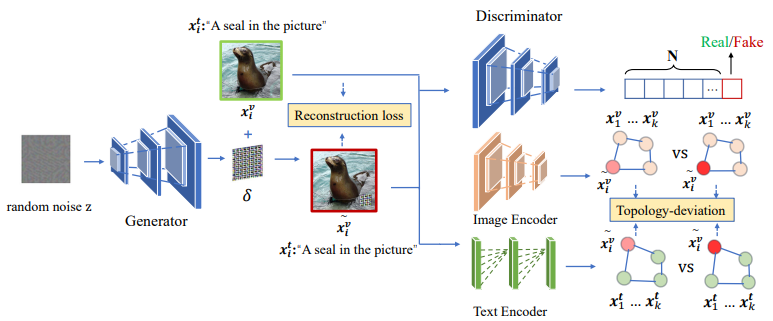

# AdvCLIP
The implementation of our ACM MM 2023 paper "AdvCLIP: Downstream-agnostic Adversarial Examples in Multimodal Contrastive Learning"


## Abstract
Multimodal contrastive learning aims to train a general-purpose feature extractor, such as CLIP, on vast amounts of raw, unlabeled paired image-text data.
This can greatly benefit various complex downstream tasks, including cross-modal image-text retrieval and image classification. Despite its promising prospect, the security issue of cross-modal pre-trained encoder has not been fully explored yet, 
especially when the pre-trained encoder is publicly available for commercial use.

In this work, we propose AdvCLIP, the first attack framework for generating downstream-agnostic adversarial examples based on cross-modal pre-trained encoders. AdvCLIP aims to construct a universal adversarial patch for a set of natural images that can fool all the downstream tasks inheriting the victim cross-modal pre-trained encoder. To address the challenges of heterogeneity between different modalities and unknown downstream tasks，we first build a topological graph structure to capture the relevant positions between target samples and their neighbors. Then, we design a topology-deviation based generative adversarial network to generate a universal adversarial patch. By adding the patch to images, we maximize their embeddings similarity to different modality and perturb the sample distribution in the feature space, achieving unviersal non-targeted attacks. Our results demonstrate the excellent attack performance of AdvCLIP on two types of downstream tasks across eight datasets. We also tailor three popular defenses to mitigate AdvCLIP, highlighting the need for new defense mechanisms to defend cross-modal pre-trained encoders.



## Latest Update
**2023/8/25**   We have released the official implementation code.

## Setup
- **Get code**
```shell 
git clone https://github.com/CGCL-codes/AdvCLIP.git
```

- **Build environment**
```shell
cd AdvCLIP
# use anaconda to build environment 
conda create -n AdvCLIP python=3.8
conda activate AdvCLIP
# install packages
pip install -r requirements.txt
# install CLIP
pip install git+https://github.com/openai/CLIP.git
```
- **The final project should be like this:**
    ```shell
    AdvCLIP
    └- utils
        └- evaluate
        └- model
    └- data
    └- output
    └- ...
    ```

- **Download datasets**
  - The related datasets are available at [here](https://pan.cstcloud.cn/s/JqKbqGfTRs). The train.pkl and test.pkl (in raw_data.rar) include image pixel features and text id features.
  - Please move the downloaded datasets into /data.
  
## Quick Start
- **Train AdvCLIP**
```shell 
python advclip.py   
```
- **Train cross downstream model**
```shell 
python train_downstream_cross.py
```
- **Train solo downstream model**
```shell 
python train_downstream_solo.py
```
- **Test performance of AdvCLIP**
```shell 
python test_downstream_task.py
```

## Acknowledge
Some of our code and datasets are based on  [CLIP4CMR](https://github.com/zhixiongz/CLIP4CMR).

## BibTeX 
If you find AdvCLIP both interesting and helpful, please consider citing us in your research or publications:
```bibtex
@inproceedings{zhou2023advclip,
  title={AdvCLIP: Downstream-agnostic Adversarial Examples in Multimodal Contrastive Learning},
  author={Zhou, Ziqi and Hu, Shengshan and Li, Minghui and Zhang, Hangtao and Zhang, Yechao and Jin, Hai},
  booktitle={Proceedings of the 31st ACM International Conference on Multimedia (ACM MM'23)},
  year={2023}
}
```
